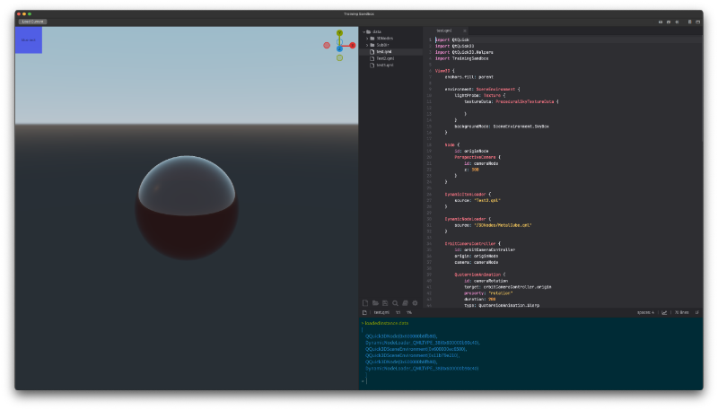

# Training Sandbox



Training Sandbox is a testbed for teaching QML and Qt Quick API's. Provided are tools to edit and inspect a running Qt Quick environment from within the app, as well as tools to dynamicly load and edit content.

## Building

To build clone this repository and run the following command:
```
git submodule update --init --recursive
```

Then either load this project's CMakeLists.txt file in Qt Creator and run, or build with CMake directly from the command line.

The module is built of of several submodules which themselves have their own submodules, so it it is important to recursively update those submodules.

## Usage

When the app starts, a set of template applications will be installed as a starting point for demonstration. These files can be loaded by selecting a file in the editor and clicking the "Load Current" button on the toolbar. This will load the QML file into the the sandbox viewer. You can edit the QML files in the editor and when a file is saved the sandbox viewer will automatically reload the updated files.  If a file contained an error, that error will be printed to the embedded script terminal.

If your Qt installation provides the qmlls (qml language server) binary, the editor will use this to provide auto-complete and inline diagnostics for syntax errors.

## Licensing

This application itself is provided under the Qt Commerical license (for now).  It also uses several 3rd party libraries which are licensed under compatible licenses (see submodule code for further details).

This application directly uses the Dripicons V2 font which is provided under either the [Creative Commons Attribution 4.0](http://creativecommons.org/licenses/by-sa/4.0/) license or the [SIL Open Font License](http://scripts.sil.org/cms/scripts/page.php?site_id=nrsi&id=OFL)

